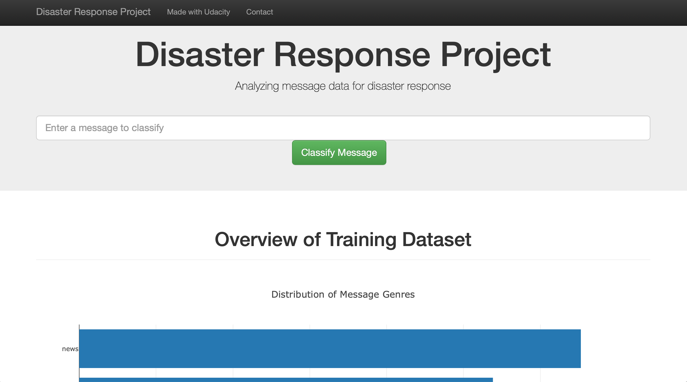

# Disaster Response Pipeline Project
This project is an application which aims at making disaster response actions more efficient with power of machine learning. The application classifies text information such as news, social media posts and any other text messages into a set of categories which are related to disaster response (e.g. floods, storm, fire or request, medical help, etc.). By classifying number of text information into the categories with high accuracy, relevant actions are expected to be taken faster and with higher confidence.
A web application is included in this project which takes text information and returns results of classification based on the machine learning model.
The web application is built on [Flask](https://www.palletsprojects.com/p/flask/) framework.

### What's Included:

```text
disaster_response/
|---------- README.md
|--app/
   |-- run.py
   |-- templates/
      |-- master.html
      |-- go.html
|--data/
   |-- disaster_categories.csv
   |-- disaster_messages.csv
   |-- process_data.py
|--models/
   |-- train_classifier.py
```


### Instructions:
1. Run the following commands in the project's root directory to set up your database and model.

    - To run ETL pipeline that cleans data and stores in database
        `python data/process_data.py data/disaster_messages.csv data/disaster_categories.csv data/DisasterResponse.db`
    - To run ML pipeline that trains classifier and saves
        `python models/train_classifier.py data/DisasterResponse.db models/classifier.pkl`

2. Run the following command in the app's directory to run your web app.
    `python run.py`

3. Go to http://0.0.0.0:3001/

### Screenshot of the web app:


### Author:
Ryo Nitta
